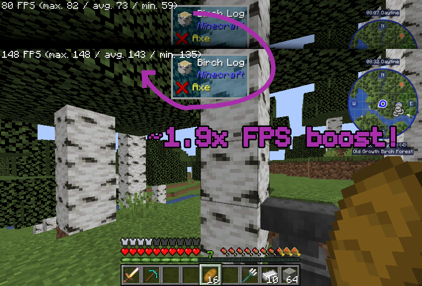

## Gnetum

A Minecraft mod that improves performance by distributing HUD updates over multiple frames.



### Overview

Gnetum divides a full HUD update into multiple "passes." Only one pass is rendered each frame, reducing the time taken on HUD updates and improving FPS.

It is the minimum FPS that decides how smooth the game feels. With this in mind Gnetum tries to evenly distribute HUD updates over multiple frames, meaning that it improves not only the average FPS, but also the minimum.

### Configuration

A configuration screen is available for advanced players and modpack makers to fine-tune Gnetum for optimal performance, accessible via keybind (bound to ```End``` by default).

- You can configure whether to cache each element, and if so, in which pass they are rendered.
- You can set the number of passes. A higher number means the HUD is updated less often, improving FPS.
- You can set a limit for the HUD framerate.
- A performance analyzer is implemented to help you monitor the rendering time of each pass.

### Compatibility

#### 1.20.1

✔️ ImmediatelyFast: fully compatible and recommended.

#### 1.12.2

⚠️ OptiFine: make sure "Fast Render" is disabled (this mod would do nothing otherwise.)

⚠️ StellarCore: make sure their HUD Caching feature is disabled (if you are unsure how to disable it you can ignore this: it's disabled by default.)

### Credits

This mod is inspired by the [HUDCaching](https://github.com/Moulberry/MCHUDCaching) mod by [Moulberry](https://github.com/moulberry).